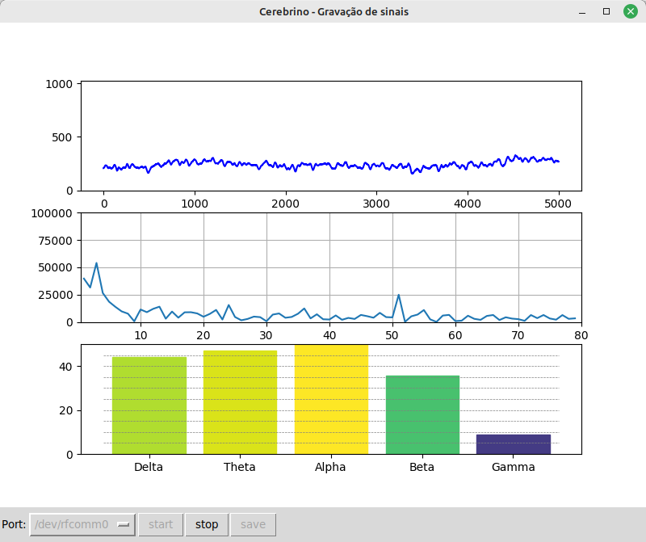
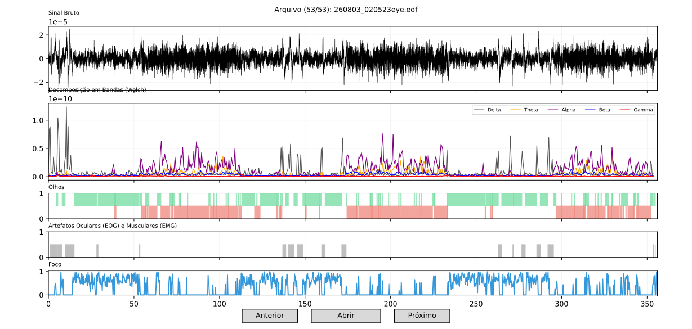
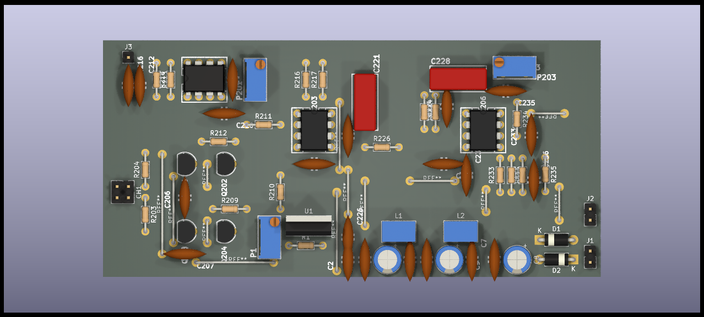

# EEG para analise e neuro-feedback usando Arduino e circuitos DIY.

## Captura

Essa é a tela de captura, inicialmente com uma interface minimalista, com diferentes gráficos combinados para facilitar a leitura.

Primeiro gráfico - sinal x tempo:
Aqui é possível acompanhar o sinal capturado, o eixo horizontal esta graduado em mili segundos.

Segundo grafico - espectrograma:
Plota o espectro de frequancia, num intervado de 0 á 80Hz

Terceiro grafico - Grafico de barras
Semelhante ao grafico de espectro, permite visualisar de forma simples e direta, as faixas de ondas:
Delta (0 a 4 Hz)
Theta (4 a 8 Hz)
Alpha (8 a 13 Hz)
Beta (13 a 30 Hz)
Gama (30 a 80 Hz)

## Análise por Inteligência Artificial

O sinal do gráfico abaixo foi processado por I.A., treinada com datasets etiquetados para olhos abertos, fechados, piscadas e movimentos musculares.
Esse sinal com duração de 6 minutos, alternando minuto a minuto entre olhos abertos e olhos fechados, iniciando com os olhos abertos.
Atualmente a análise é feita offline, mas o objetivo é que a I.A. efetue a análise em tempo real e que a interface traduza o resultado em estímulos sonoros e visuais, possibilitando que o usuário possa aprender a controlar seus estados mentais.

## Placa
Circuito de aquisição de sinais

