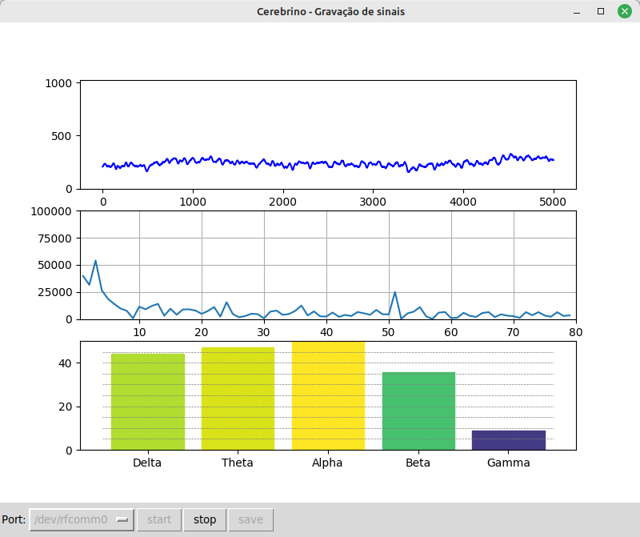
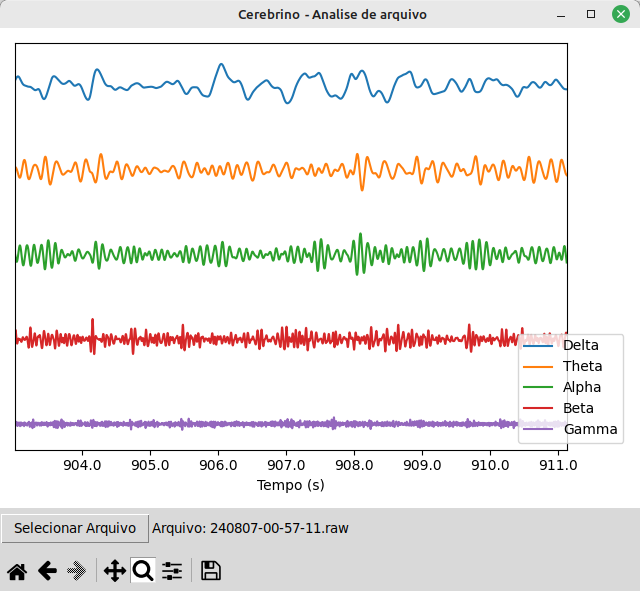

Projeto EEG open source com componentes encontrados no Brasil.

O circuito é totalmente baseado no projeto OpenEEG.
https://openeeg.sourceforge.net/doc/modeeg/modeeg.html

Captura

Análise

Placa

